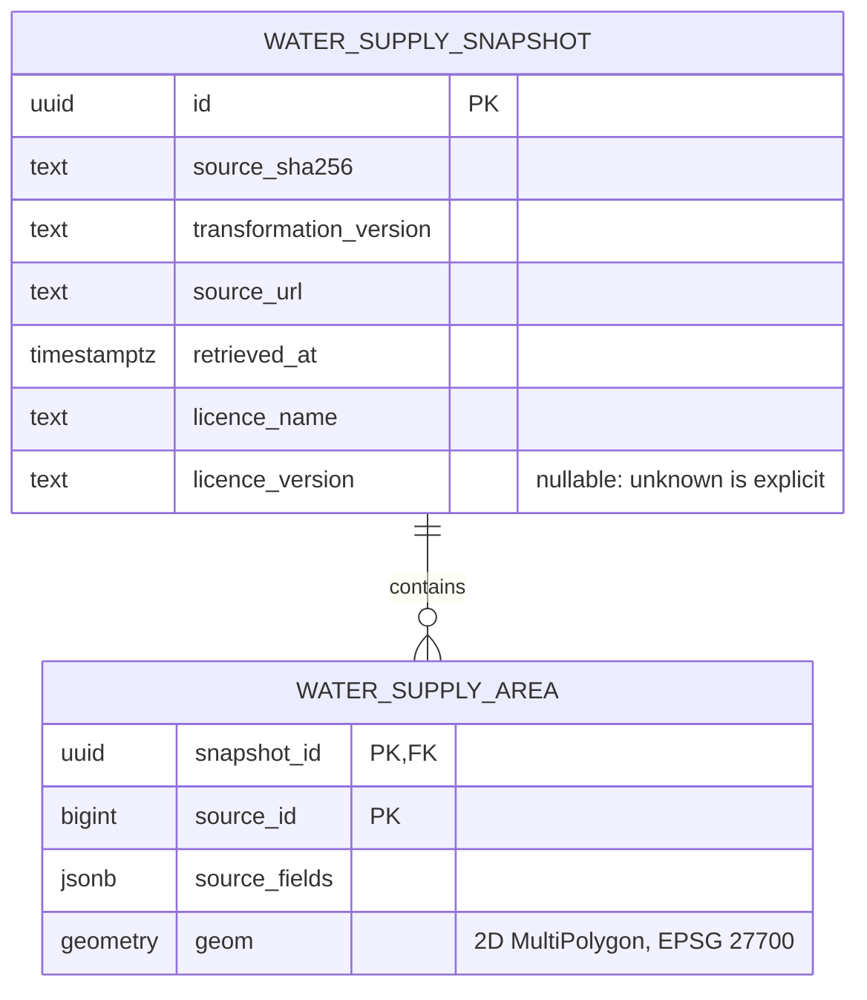

# 0002: Water-supply snapshots and strict geometry acceptance

- Status: accepted for schema and synthetic tests; real-data integration pending
- Date: 2026-09-17
- Migration: `0002`

## Context

The [source assessment](../data-sources/ofwat-company-boundaries.md) found that IDs
identify areas within a layer, company labels are not stable company identifiers,
and some source polygons are invalid. The data is a dated analytical representation,
not a legal or current property-supplier register. The publisher declares OGL, but
the exact edition and final attribution remain to be resolved before integration.

## Decision

Create two water-supply-specific tables in `watergeo`. No publisher records are
seeded. The migration is the schema definition; ORM mappings and an ingestion
service are deferred until application queries need them. Existing SQLAlchemy,
Alembic, and PostGIS are sufficient; no Python geometry dependency is added.

### Snapshot identity and provenance

`water_supply_snapshot` records the archive SHA-256, byte count, source URL,
retrieval time, publisher, distributor, licence name/version/link, attribution,
transformation version, and database ingestion time. Retrieval time is supplied
explicitly; ingestion time is generated by the database. Neither is a source
update date. Dates/version strings declared inside individual source rows stay in
`source_fields`, including disagreements with archive filenames or HTTP metadata.

The unique key is `(source_sha256, transformation_version)`. The same bytes and
same transformation cannot be inserted twice. Reprocessing under a changed policy
can create a new snapshot without overwriting the old one. This is a database
uniqueness guarantee; a future importer must implement no-op/retry behaviour.

The UUID is an internal relationship key, not a publisher identifier. Snapshot
rows are not a licence-approval registry: nullable `licence_version` preserves
uncertainty and must not be treated as permission to publish. The source-acceptance
review remains required. Nonempty strings protect against missing provenance;
they do not verify that a URL, attribution, fingerprint, or licence claim is true.

### Area identity and source meaning

`water_supply_area` uses `(snapshot_id, source_id)` as its primary key. The source
ID is not globally unique and is not a company ID. The table's water-supply scope
defines the service; a contradictory source `AreaType` must not change it.

The JSON object `source_fields` retains source field names and decoded values,
including Unicode, nulls, warnings, provenance, licence text, and contradictory
labels. It is deliberately source-specific metadata alongside a relational key
and spatial geometry, not a generic observation model. Original ZIP bytes will
remain the authoritative raw representation: JSON does not preserve DBF bytes,
field order, date sentinels, or encoding. The future importer must verify all 17
expected fields and match the extracted ID to `source_id`; this migration only
requires a JSON object. Raw storage and its locator are not implemented yet.

Foreign keys reject orphan areas and prevent deleting a snapshot while it has
areas. No cascade deletion is configured. These tables are intended as historical
snapshots; they do not yet enforce immutability against their migration-role owner.
The existing runtime role receives SELECT only through default privileges.

### Geometry policy: reject invalid input

1. Require a known source CRS of EPSG:27700 and exactly two dimensions. Do not
   guess a CRS or silently remove elevation/measure coordinates.
2. Permit Polygon input to be wrapped as MultiPolygon with
   [ST_Multi](https://postgis.net/docs/ST_Multi.html). Wrapping is not repair or
   reprojection. Tests exercise that explicit write expression; the table itself
   accepts only MultiPolygon and does not transform input.
3. Reject null, empty, non-polygonal, and invalid geometry. Use
   [ST_IsValid](https://postgis.net/docs/ST_IsValid.html) with flags `0` for standard
   validity rules and no per-row NOTICE output. An independent emptiness check is
   needed because valid geometry may be empty.
4. Do not run `ST_MakeValid`, simplify, snap, round, drop bad records, or infer a
   corrected boundary. A repair policy needs separate evidence and measured effects.

The geometry column uses explicit type/SRID/dimension checks instead of a PostGIS
geometry typmod. This prevents unknown-SRID input being silently assigned the
column's SRID. The separate NOT NULL constraint matters because SQL CHECK
constraints alone can accept NULL. A GiST index supports future spatial queries;
the primary key also supports looking up all areas in a snapshot.

Checks validate each feature independently. Overlaps between otherwise valid
areas remain distinct; validity does not prove coverage completeness or legal
accuracy. Synthetic tests demonstrate that a boundary point can match multiple
areas using `ST_Covers`. No public query contract or choice of a single supplier
is introduced in this milestone.

### Transaction boundary

A future importer must insert a snapshot and **all** its areas in one transaction,
validate expected counts, and commit only when the whole load passes. Any rejected
area must abort that transaction; skipping errors and committing a partial load
is prohibited. The tests exercise full rollback after one good and one bad area.
The schema alone cannot detect a caller that intentionally omits records or commits
partial work. There is no publication flag or current-snapshot selector yet.

## Consequences and next milestone

The five invalid water-supply polygons found in the assessment will fail this
policy. This is deliberate: the current release is **not ready for full loading**.
A source correction or a separately reviewed repair policy is needed. The exact
licence edition/final attribution must also be resolved before real-data integration.

Next, evaluate repair behaviour using synthetic cases and specify how a future
transformation would record algorithm/library versions and geometry changes.
Then implement bounded retrieval, raw retention, schema validation and atomic
loading once source acceptance is complete. Do not silently relax constraints to
make a download pass.

## Verification and operations

Opt-in integration tests run against real PostGIS on a disposable database. They
cover accepted holes/multipart areas, coordinate preservation, self-intersections,
nested holes, empty/null/wrong-type/wrong-CRS/3D input, snapshot identity,
provenance constraints, transaction rollback, migration downgrade/upgrade,
readiness, and runtime SQL permissions. All fixtures are invented and MIT-licensed
with the repository; none reproduces publisher geometry.

Apply locally with `uv run --locked alembic upgrade head`. Readiness now expects
revision `0002`. Downgrading to `0001` **drops both tables and their data**; test
rollback only on disposable databases. The normal development database must
never be used for the destructive integration suite.
