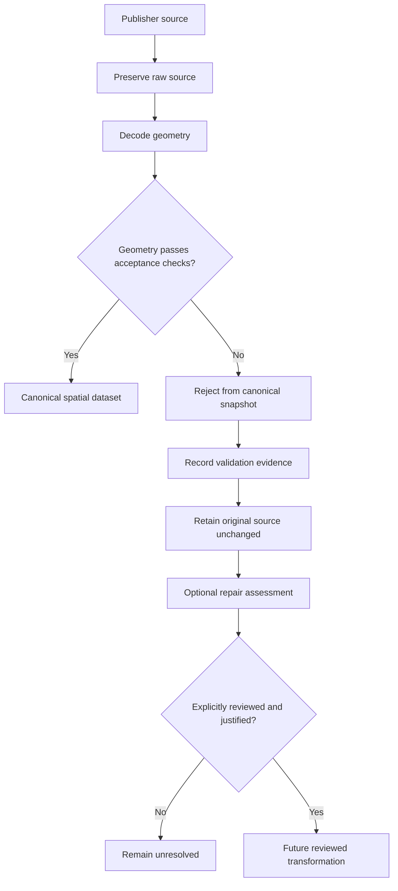

# 0003: Preserve invalid source geometry and prohibit silent repair

* Status: accepted
* Date: 2026-09-17
* Supersedes: none
* Related: ADR 0002, PR #6

## Context

ADR 0002 established strict geometry acceptance for water-supply boundaries and
deliberately prohibited `ST_MakeValid`, simplification, snapping, rounding,
dropping invalid records, or otherwise inferring corrected publisher geometry.

That decision was intentionally temporary until repair behaviour could be measured.

The source assessment identified invalid polygon geometries in the candidate Ofwat
water-supply boundary dataset. Simply rejecting them indefinitely would prevent a
complete snapshot from being loaded, but automatically repairing them without
understanding the effects could alter the meaning of publisher-supplied boundaries.

WaterGeo UK must prioritise provenance and reproducibility over successfully loading
every source record.

A geometry becoming technically valid does not demonstrate that it still represents
the same geography intended by its publisher.

PR #6 therefore introduced a synthetic PostGIS experiment comparing
`ST_MakeValid` strategies against deliberately constructed geometry problems.

The experiment contains no publisher geometry and does not approve any repaired
publisher record for ingestion.

## Evidence

Synthetic cases were created for:

* self-intersecting polygons;
* nested holes;
* overlapping MultiPolygon components;
* collapsed polygons;
* polygon spikes;
* valid polygons containing holes as a control.

The experiment evaluated PostGIS `ST_MakeValid` using:

* `method=linework`;
* `method=structure keepcollapsed=true`;
* `method=structure keepcollapsed=false`.

For each candidate, the experiment records properties including:

* validity;
* geometry type;
* emptiness;
* SRID;
* dimensionality;
* area;
* component count;
* presence of lower-dimensional components;
* point coverage;
* repair idempotence;
* coordinate equality;
* reproducible EWKB hashes.

The results demonstrate several important behaviours.

### Valid output does not imply equivalent coverage

For synthetic nested-hole and overlapping-part cases, different
`ST_MakeValid` strategies produced geometries that were all valid but disagreed on
whether selected points were covered.

Therefore `ST_IsValid(candidate) = true` is not sufficient evidence that a repair
preserved the intended boundary.

### Repair can change geometry class

A collapsed polygon can become a `LINESTRING`, `MULTILINESTRING`, or an empty
polygon depending on the repair strategy.

An automatically repaired feature could therefore cease to represent an area at all.

### Repair can remove information without changing area

The synthetic spike case demonstrated that two repaired representations can report
the same polygon area while one discards a lower-dimensional feature retained by
another.

Area comparison alone cannot prove semantic equivalence.

### Invalid source area is not necessarily meaningful

For self-intersecting source geometry, the area calculated from the invalid input
cannot be treated as an authoritative baseline for determining whether a repaired
candidate is correct.

A percentage-area-difference threshold would therefore create false confidence.

## Decision

WaterGeo UK will not silently repair invalid publisher geometry.

The original publisher representation must remain recoverable and authoritative for
provenance purposes.

The ingestion policy is:



### Original geometry must be preserved

A repair operation must never overwrite the source geometry or remove the ability to
recover the exact publisher input.

For downloadable datasets, the immutable downloaded archive or equivalent source
artifact remains the primary raw representation.

Checksums and retrieval metadata must continue to identify that artifact.

### Invalid geometry must fail canonical ingestion

Geometry that fails the accepted type, dimensionality, CRS, emptiness, or validity
rules from ADR 0002 must not be silently inserted into
`watergeo.water_supply_area`.

For an atomic source snapshot, an invalid required feature causes the snapshot load
to fail rather than producing an incomplete published snapshot.

This preserves the existing all-or-nothing transaction rule.

### Invalid records must not simply be dropped

Skipping invalid features and committing the remainder would produce an apparently
valid but incomplete geographic dataset.

WaterGeo UK must make incompleteness explicit rather than silently changing source
coverage.

### Automatic `ST_MakeValid` is prohibited for canonical ingestion

`ST_MakeValid` may be used for diagnostics and controlled experiments.

Its output must not automatically become canonical geometry.

The following are also prohibited as implicit fixes:

* simplification;
* coordinate snapping;
* coordinate rounding;
* buffer-based repair such as `ST_Buffer(geom, 0)`;
* removing components;
* converting lower-dimensional output back into polygons;
* guessing source CRS;
* silently transforming unknown CRS;
* deleting problematic records.

### A future repair is a transformation, not a correction of history

If WaterGeo UK later accepts a repaired geometry, it must be represented as a
separate, explicit transformation of the original source.

At minimum, such a transformation should be capable of recording:

* original source/snapshot identity;
* original source feature ID;
* transformation identifier and version;
* algorithm and parameters;
* relevant PostGIS/GEOS version;
* review status;
* reason for transformation;
* validation results;
* transformed geometry hash;
* reviewer or approval mechanism where appropriate.

The exact schema for repair provenance is intentionally deferred until a real repair
is justified.

No repair table is introduced by this ADR.

### There is no generic numerical auto-approval threshold

WaterGeo UK will not currently adopt rules such as:

> Automatically accept a repaired polygon when its area changes by less than 1%.

The experiment demonstrates that area equality or similarity does not guarantee
equivalent spatial meaning.

Future acceptance criteria must consider the characteristics of the real dataset and
the publisher's intended semantics.

### Publisher correction is preferred

Where feasible, correction or clarification from the publisher is preferable to
WaterGeo UK independently inferring the intended boundary.

A publisher-provided corrected release can be ingested as a new immutable snapshot
with its own provenance.

## Consequences

This policy favours correctness and provenance over completeness.

A source release containing required invalid geometries may remain unavailable as a
canonical WaterGeo UK snapshot until the source is corrected or a specific repair
policy is reviewed.

That is an accepted consequence.

WaterGeo UK may still report that the source exists and document why it cannot yet
be published through canonical spatial queries.

The platform must distinguish:

* discovering a source;
* retaining a raw source;
* validating a source;
* accepting a source into canonical storage;
* publishing/querying canonical data.

These are separate lifecycle states and must not be conflated.

The policy also prevents WaterGeo UK from presenting inferred geometry as though it
were directly supplied by the original publisher.

## Alternatives considered

### Automatically use `ST_MakeValid`

Rejected because different valid outputs can represent different spatial coverage
and can change geometry type or remove components.

### Accept repairs based on small area change

Rejected because area similarity does not demonstrate equivalent topology or point
membership, and invalid source area may itself be unreliable.

### Drop invalid source features

Rejected because doing so would create incomplete snapshots without preserving the
publisher's complete intended feature set.

### Store invalid geometry directly in the canonical table

Rejected because downstream users could unknowingly perform spatial analysis against
topologically invalid data.

### Manually edit source geometry

Rejected as a default policy because it creates an undocumented WaterGeo-authored
interpretation unless represented as an explicit, reproducible transformation.

## Verification

The decision is supported by the synthetic experiment in:

```text
tests/fixtures/geometry_repairs.sql
tests/integration/test_geometry_repairs.py
scripts/assess_geometry_repairs.py
```

The experiment runs against PostGIS using invented EPSG:27700 planar geometry and
does not use publisher data.

At acceptance, all geometry experiment tests and the complete project test suite
passed.

The experiment should remain as regression evidence for this decision.

## Next milestone

Do not perform further generic geometry-repair experimentation unless real source
behaviour creates a new question.

The next milestone is the first bounded real-data ingestion vertical slice.

That work should implement:

* controlled retrieval of the accepted public Ofwat boundary source;
* immutable raw artifact retention;
* SHA-256 fingerprinting;
* source and licence provenance;
* expected archive/file/schema validation;
* deterministic decoding;
* geometry validation under ADR 0002 and this ADR;
* explicit reporting of rejected features;
* atomic snapshot loading;
* reproducible ingestion results.

The milestone must not weaken geometry constraints merely to make the current
publisher dataset load successfully.
