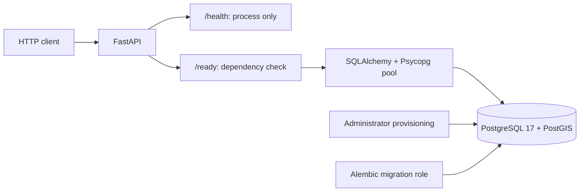

# Phase 0 architecture

This document records the Phase 0 foundation: one Python application and one
PostgreSQL/PostGIS database. Migration `0002` now adds water-supply domain tables;
see the [schema decision](../adr/0002-water-supply-snapshots.md). There are still
no providers, ingestion services, or water-data endpoints.

## Boundaries and dependency choices

| Component | Responsibility and rationale |
| --- | --- |
| FastAPI / Uvicorn | Typed HTTP endpoints, OpenAPI, and ASGI serving. |
| Pydantic / pydantic-settings | Validate configuration before startup; load environment and optional local dotenv values. |
| SQLAlchemy 2 / Psycopg 3 binary | Structured connection URLs, bounded pooling, and PostgreSQL access without a local compiler/libpq setup. |
| Alembic | Explicit, versioned schema changes through separate migration credentials. |
| pytest / httpx2 | Test application behaviour through Starlette's supported in-process HTTP test client. |
| Ruff / mypy / pre-commit | Lint/security rules, formatting, strict application typing, and locked local hooks. |
| pip-audit | Check locked runtime and development packages against published vulnerability information. |
| Hatchling / uv | Build a standard wheel and manage one committed dependency lock. |

Synchronous SQLAlchemy calls run in FastAPI's thread pool because endpoints are
ordinary `def` functions. This is sufficient for two operational endpoints.
Future asynchronous ingestion can be designed around actual concurrency needs.
The application factory creates the engine during its lifespan and disposes it
on shutdown; module imports do not connect to a database.

The `src` layout forces tests to import the installed package. Python 3.12 is the
initial tested baseline; newer versions are allowed by package metadata but are
not yet separately certified. Python dependency versions and hashes are locked.
Build backend requirements and OS images/packages remain version-range/tag based,
so complete bit-for-bit container reproducibility is not claimed.

## Database lifecycle

Initialisation of a new Compose volume installs PostGIS in `public`, creates a
`watergeo` schema owned by `watergeo_migrator`, and creates `watergeo_app` with
read-only table access. Default privileges give that API role SELECT on future
tables created by the migration role in the application schema.

The `postgres` administrator credential stays with the database container. The API
cannot create roles, create application tables, or write to the migration table.
The read-only transaction default adds protection, but actual SQL grants enforce
the boundary even if that default is disabled. Migration credentials are available
only to the explicit migration process.

Alembic's version table lives in `watergeo`. Revision `0001` verifies that PostGIS
is provisioned and establishes the application baseline. Its downgrade removes
the revision marker; it intentionally leaves the administrator-owned schema,
roles, and extension intact. The subsequent source assessment justified the
snapshot/area tables in revision `0002`, which readiness now expects.

Database initialisation scripts run only once, on an empty volume. For an existing
volume, password changes need administrator-driven role rotation; editing `.env`
alone is insufficient. For expendable local data, `docker compose --profile app
down --volumes` deletes the database, after which `up` provisions it again. Do not
use this reset on data you need. Keep integration tests on a separate Compose
project/volume as shown in the README.

Role names and the `watergeo` database name are fixed in local provisioning. Host,
port, database name, and users are configurable in Python to allow externally
provisioned environments later; those environments must supply equivalent grants
and schema/extension provisioning.

## Liveness, readiness, and failure

`/health` says whether the application responds. `/ready` uses the API database
role to verify `PostGIS_Version()` and the expected Alembic revision. Both responses
disable caching. A connection failure, missing extension/version table, or wrong
revision returns HTTP 503 without exposing database details. Health remains HTTP
200 when the database is unavailable, avoiding unnecessary application restarts.

Pool size is five with no overflow. Pool acquisition and connection attempts are
bounded to three seconds; statements and lock waits are bounded to three seconds.
These are component limits, not an absolute end-to-end deadline: failed connections
and pre-ping/reconnection can involve several bounded operations. Readiness probes
should be infrequent; no external API calls occur during probes.

JSON application logs contain UTC time, level, logger, event, and an optional
exception class. Database exception messages/tracebacks and request payloads are
not logged by readiness. Successful probes are not logged. This is deliberately
small; request tracing and ingestion-run telemetry come with those workloads.

## Validation and CI

The fast suite verifies configuration precedence/secrecy, credential separation,
HTTP contracts, failure sanitisation, CORS defaults, and engine cleanup. Integration
tests opt in with `WATERGEO_TEST_DATABASE=1` and fail if the configured database is
unavailable; they exercise migration repeatability/rollback, spatial operations,
and real SQL permission denials.

CI runs quality checks and package builds, then builds and exercises the complete
Compose setup on AMD64 and ARM64 Linux. It checks readiness during a database outage
and recovery. Security jobs audit dependencies and run CodeQL on changes and weekly.
Local verification and GitHub CI results must be reported separately for each change.

## Postponed

Provider interfaces, canonical models, geometry libraries, raw storage, dataset
licensing implementations, observation schemas, spatial query APIs, SDK/CLI, maps,
authentication, cloud services, and production operations follow actual needs.
The first source investigation now informs the water-supply schema and synthetic
tests. Real-data integration still requires completing the licence assessment.
