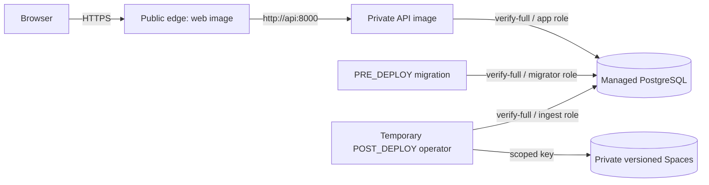

# DigitalOcean first-preview deployment

**Status: pending external provisioning. Provider review: 28 September 2026.**

No hosted endpoint or DigitalOcean resource is claimed by this document. Provisioning
requires a separately approved cost proposal and a reviewed `main` commit.

## Reviewed provider contract

The current DigitalOcean documentation confirms:

- App Platform supports image-backed services, internal ports, PRE/POST_DEPLOY jobs,
  app-level `${APP_DOMAIN}` and database CA bindables, and app-spec validation.
- `http://api:8000` is the supported service-name route for the internal API.
- GHCR images can be selected by digest; App Platform runs AMD64 and does not
  automatically redeploy a changed GHCR tag.
- London App Platform uses region slug `lon`; Managed PostgreSQL and Spaces use
  datacenter slug `lon1`. Availability must still be queried immediately before
  provisioning.
- App Platform `lon` connects directly to a `lon1` VPC when its UUID is present in
  the app spec; the database private hostname then stays on that network.
- Standard Managed PostgreSQL supports `verify-full` with its downloaded CA, PostGIS,
  trusted application sources, daily backups and seven-day point-in-time recovery.
- Spaces uses `https://<region>.digitaloceanspaces.com`; objects are private by default,
  versioning must be enabled through the S3-compatible API, and scoped keys can grant
  one bucket Read/Write/Delete object access.

Primary references: [App spec](https://docs.digitalocean.com/products/app-platform/reference/app-spec/),
[internal routing](https://docs.digitalocean.com/products/app-platform/how-to/manage-internal-routing/),
[environment bindables](https://docs.digitalocean.com/products/app-platform/how-to/use-environment-variables/),
[jobs](https://docs.digitalocean.com/products/app-platform/how-to/manage-jobs/),
[health checks](https://docs.digitalocean.com/products/app-platform/how-to/manage-health-checks/),
[VPC networking](https://docs.digitalocean.com/products/app-platform/how-to/enable-vpc/),
[container images](https://docs.digitalocean.com/products/app-platform/how-to/deploy-from-container-images/),
[PostgreSQL connection security](https://docs.digitalocean.com/products/databases/postgresql/how-to/connect/),
[trusted sources](https://docs.digitalocean.com/products/databases/postgresql/how-to/secure/),
[PostGIS](https://docs.digitalocean.com/products/databases/postgresql/details/supported-extensions/),
[database backups](https://docs.digitalocean.com/products/databases/postgresql/details/features/),
[Spaces versioning](https://docs.digitalocean.com/products/spaces/how-to/enable-versioning/), and
[Spaces access](https://docs.digitalocean.com/products/spaces/how-to/manage-access/).

## Architecture and inventory

| Resource | Region/size | Exposure | Baseline monthly estimate |
| --- | --- | --- | ---: |
| Edge service | `lon`, `apps-s-1vcpu-0.5gb`, one instance | HTTPS ingress | US$5.00 |
| API service | `lon`, `apps-s-1vcpu-0.5gb`, one instance | internal port 8000 | US$5.00 |
| PostgreSQL 17 | `lon1`, Basic/Regular 1 GiB, 1 vCPU, 10 GiB | VPC + trusted app IP only | US$15.15 |
| Spaces Standard | `lon1`, private, no CDN | operator key only | US$5.00 |

Baseline is **US$30.15/month before tax**. Deployment jobs are billed by runtime;
one migration and a one-time 2 GiB bootstrap should normally add less than US$0.10,
but duration is workload-dependent. Transfer, storage above included allowances,
backup exports, custom domains, tax and future schedules are excluded. The smallest
database has no standby HA.

DigitalOcean documents 25 PostgreSQL connections per GiB with three reserved for
maintenance. The single five-connection API pool plus one five-connection operator or
migration pool stays below the 22 client-connection remainder; the deployment starts
with one API instance and no autoscaling.

## Component secret matrix

| Component | Database identity | CA | Spaces | Other secrets |
| --- | --- | --- | --- | --- |
| Browser/web image | none | none | none | none |
| API | `watergeo_app` password | database CA bindable | none | none |
| Migration job | `watergeo_migrator` password | database CA bindable | none | none |
| Temporary bootstrap/operator | `watergeo_ingest` password | database CA bindable | one-bucket object key | none |
| Local provisioning only | provider administrator | downloaded CA | full bucket configuration key | three generated role passwords |

The API never receives migration, ingestion, administrator, or Spaces credentials.
App Platform receives no provider database administrator password. Secrets use
component-scoped `SECRET` variables and never build arguments.

## Provisioning order

1. Merge and review this deployment contract, publish the three commit-addressed GHCR
   images from `main`, record their digests, and confirm package visibility or configure
   the least-privilege GHCR pull credential.
2. Run `watergeo-production-preflight`; it is read-only and reports missing names only.
   `doctl` is currently required (`brew install doctl` on macOS). Initialise its auth
   interactively without putting a token on the command line.
3. Confirm `lon` App Platform, `lon1` database/Spaces, and selected sizes are currently
   available. Stop for approval if a common London deployment is unavailable.
4. Create or select a `lon1` VPC, record its UUID, and create the smallest PostgreSQL
   cluster in that VPC. Record its private hostname as
   non-secret deployment metadata; do not pass a provider URL or provider username to
   any component. Temporarily trust the operator's current IP only for provisioning,
   download its CA, and run
   `scripts/provision_production_database.py` with credentials supplied through the
   environment. Run migrations, then `scripts/verify_production_database.py`.
5. Bind the App Platform app to the same VPC. Add the app VPC egress private IP as the
   database trusted source, as required by current DigitalOcean VPC guidance. Remove
   the temporary developer IP and confirm the trusted-source list contains only the
   app VPC source.
6. Create one private Standard Spaces bucket in `lon1`, without CDN. Use a full
   one-time configuration key to run `scripts/verify_evidence_bucket.py configure`.
   Create a dedicated bucket-scoped Read/Write/Delete key for the operator and run
   `scripts/verify_evidence_bucket.py verify-operator`. The probe deletes only its
   exact version; it never lists or deletes WaterGeo evidence.
7. Render the normal app spec outside Git. It uses the recorded private hostname, while
   the managed-database app binding supplies only the CA bindable and trusted-source
   relationship. Validate it with `doctl apps spec validate`
   and create the app with maintenance enabled. The generated `${APP_DOMAIN}` bindable
   supplies the exact edge server name and API trusted hostname.
8. The PRE_DEPLOY job runs `alembic upgrade head` with the API image and migrator role.
   API and edge use TCP provider probes. The Docker API health check sends the exact
   internal-only host `health.internal`; nginx rejects every public Host except the
   generated app domain, then preserves that domain to FastAPI. `/health` remains
   process liveness and `/ready` remains database/migration readiness.
9. Render a separate spec with `--include-bootstrap`. Its temporary POST_DEPLOY job uses
   the operator image and accepted `watergeo-demo-bootstrap` refresh/evidence gates for
   all six source families. Do not expose traffic while it runs. If a reviewed static
   publisher dependency cannot be retrieved, stop; do not use a mirror or local DB.
10. Record the job result and source status, then immediately apply the normal spec to
    remove bootstrap. Future deploys run only migrations. No recurring job exists.
11. Verify internal state, render `--public`, deploy, then externally run HTTPS-only
    `watergeo-demo-smoke https://<APP_DOMAIN> --complete --explorer` plus the manual
    desktop/mobile explorer checklist.

The CA wrapper removes the PEM environment value from the child environment, writes a
bounded PEM file with mode `0600`, sets `WATERGEO_DB_SSLROOTCERT`, and uses
`verify-full`. Each container is ephemeral, so its temporary filesystem is discarded.

## Role and data verification

Provisioning is idempotent: it creates or rotates the three fixed login roles, creates
`watergeo`, installs PostGIS, assigns the `watergeo` schema to the migrator, revokes
public database/schema privileges, and grants only schema usage to app/ingest. Existing
migrations remain authoritative for table grants. Verification authenticates each
identity and proves app writes, ingest UPDATE/DELETE/schema creation, and all elevated
role attributes are rejected; the migrator can manage the application schema.

Bootstrap uses fresh publisher retrieval or accepted retained source evidence through
the existing refresh contracts. It never restores a developer database. Each accepted
bundle is archived below `watergeo/evidence` before publication.

## Acceptance and monitoring

Require HTTPS redirect, no direct API route, exact Host rejection, inaccessible public
PostgreSQL, private/versioned bucket, all six sources, `/health`, `/ready`, OpenAPI,
source status, search, complete smoke, and manual explorer checks. Use App Platform's
deployment/domain failure alerts and built-in service/database metrics. Phase 15 owns
schedule activation, formal alert routing and a managed restore drill.

## Rollback

- Roll edge or API back to a previously recorded image digest only while the schema is
  compatible.
- Do not assume Alembic downgrade. Recover an incompatible schema into a separately
  restored managed database and switch only after verification.
- A rejected refresh leaves the previously accepted snapshot current.
- Preserve the prior web digest for edge rollback.

## Teardown and evidence safety

1. Enable maintenance, retain deployment/source records, and delete the App Platform
   app.
2. Confirm no temporary trusted IP remains; then delete PostgreSQL only after deciding
   whether a final backup/export is required.
3. Revoke the dedicated operator Spaces key.
4. Decide evidence retention separately. Generic teardown **must not delete the bucket**.
   Emptying or deleting versioned evidence requires a distinct, explicit destructive
   approval and retention decision.

There is deliberately no `destroy all` helper.
